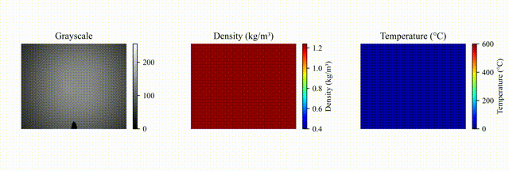

This repository contains the source code for the research paper *"Physics-Informed Shadowgraph Density Field Reconstruction"*.

### Overview
This code implements a physics-informed framework for reconstructing density fields from shadowgraph images. The approach combines shadowgraph imaging techniques with physics-informed neural networks (PINNs) to accurately capture refractive index variations in complex flow fields.

](https://github.com/pyrimidine/Physics-informed-Shadowgraph-Density-Field-Reconstruction/blob/7813ac0001175ee698601809498e7e402c0ceada/alcohol%20burner%20flame.gif)

### Key Features
- **Shadowgraph Image Processing**: Pre-processing and analysis of shadowgraph images for density field visualization.
- **PINN Implementation**: Physics-informed neural network setup tailored for accurate density field reconstruction.
- **Density Field Reconstruction**: Algorithms for computing density distributions based on refractive index variations within the experimental field.

### Usage
This code is intended solely for academic use. 

### Requirements
All necessary dependencies are listed in `requirements.txt`.

### License
This code is for academic use **ONLY**. Please cite the original paper if you use this code in your research.
